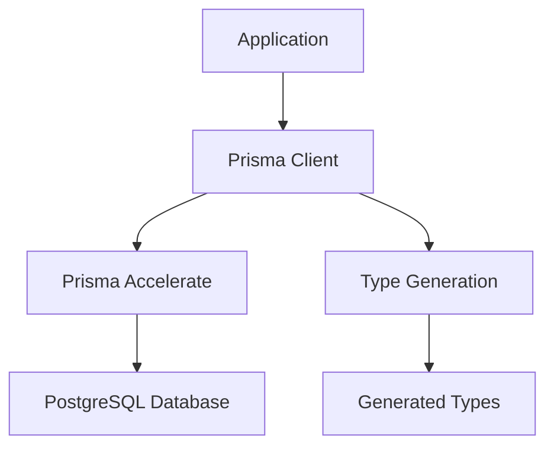

# Architecture Documentation

## Overview

Personal Finance Management App is built with a modern, scalable architecture focusing on type safety, performance, and maintainability. The application follows a full-stack approach with clear separation of concerns.

## Tech Stack Deep Dive

### Frontend Architecture

#### Next.js 15 with App Router

- **Server-Side Rendering**: Optimized for SEO and performance
- **Client Components**: Interactive UI elements
- **File-based Routing**: Intuitive route organization
- **Built-in Optimizations**: Image optimization, font loading, bundle splitting

#### React 19 Features

- **Concurrent Rendering**: Improved user experience
- **Automatic Batching**: Optimized state updates
- **Modern Hooks**: Enhanced component lifecycle management

#### TypeScript Integration

- **Strict Mode**: Enhanced type checking
- **Path Aliases**: `@/` prefix for clean imports
- **Type-safe API Calls**: End-to-end type safety

#### Styling Architecture

- **Tailwind CSS 4**: Utility-first CSS framework
- **CSS Variables**: Dynamic theming support
- **Component Variants**: shadcn/ui component system
- **Responsive Design**: Mobile-first approach

### Backend Architecture

#### Database Layer



#### Prisma ORM

- **Type-safe Queries**: Auto-generated TypeScript types
- **Migration System**: Version-controlled schema changes
- **Connection Pooling**: Optimized database connections
- **Query Optimization**: Intelligent query planning

#### Custom Client Generation

```typescript
// Generated client location: /src/generated/prisma
import { PrismaClient } from "../generated/prisma";
import { withAccelerate } from "@prisma/extension-accelerate";
```

## Project Structure

```tree
personal_finance/
├── src/
│   ├── app/                      # Next.js App Router
│   │   ├── layout.tsx            # Root layout with global providers
│   │   ├── page.tsx              # Home page with metadata
│   │   ├── globals.css           # Global styles and CSS variables
│   │   └── favicon.ico           # Application favicon
│   │
│   ├── lib/                      # Utility libraries and configurations
│   │   ├── prisma.ts             # Prisma client setup with Accelerate
│   │   ├── metadata.config.ts    # SEO metadata generator
│   │   ├── pages.config.ts       # Page configuration system
│   │   └── utils.ts              # General utility functions
│   │
│   └── generated/                # Auto-generated files (Git ignored)
│       └── prisma/               # Generated Prisma client
│           ├── index.ts          # Main client export
│           ├── client.js         # Compiled client
│           └── schema.prisma     # Generated schema copy
│
├── prisma/                       # Database configuration
│   ├── schema.prisma             # Main database schema
│   ├── seed.ts                   # Database seeding script
│   └── migrations/               # Version-controlled migrations
│       ├── migration_lock.toml   # Migration lock file
│       └── 20250818174445_init/  # Initial migration
│           └── migration.sql     # Migration SQL
│
├── docs/                         # Documentation
│   ├── ARCHITECTURE.md           # This file
│   ├── SETUP.md                  # Development setup guide
│   ├── API.md                    # API documentation
│   ├── DATABASE.md               # DB documentation
│   └── CONTRIBUTING.md           # Contribution guidelines
│
├── components.json               # shadcn/ui configuration
├── eslint.config.mjs             # ESLint configuration
├── LICENSE                       # MIT License file
├── next.config.ts                # Next.js configuration
├── package.json                  # Project dependencies
├── postcss.config.mjs            # PostCSS configuration
├── README.md                     # Project overview
└── tsconfig.json                 # TypeScript configuration
```

## Key Design Decisions

### 1. Custom Prisma Client Location

**Decision**: Generate Prisma client in `/src/generated/prisma`
**Rationale**:

- Keeps generated code separate from application code
- Easier to exclude from Git and IDE indexing
- Clear distinction between written and generated code

### 2. Metadata Configuration System

**Decision**: Custom metadata generation with page-specific configs
**Implementation**:

```typescript
// lib/pages.config.ts
export const pagesConfig: PagesConfig = {
  app: {
    title: "Dashboard",
    description: "Overview of your financial health",
  },
};

// lib/metadata.config.ts
export function generateMetadata(page: keyof PagesConfig) {
  const { title, description } = pagesConfig[page] ?? pagesConfig["app"];
  return { title, description };
}
```

**Benefits**:

- Centralized SEO management
- Type-safe page metadata
- Easy to maintain and extend

### 3. Font Strategy

**Decision**: Roboto font with CSS variables
**Implementation**:

```typescript
const roboto = Roboto({
  variable: "--font-roboto",
  subsets: ["latin"],
});
```

**Benefits**:

- Optimized font loading
- CSS variable flexibility
- Consistent typography system

### 4. shadcn/ui Configuration

**Decision**: New York style with Zinc base color
**Configuration**:

```json
{
  "style": "new-york",
  "rsc": true,
  "tailwind": {
    "baseColor": "zinc",
    "cssVariables": true
  }
}
```

**Benefits**:

- Professional, clean design system
- React Server Component support
- CSS variables for theming

## Data Flow

### Request Lifecycle

1. **Client Request**: User interaction or page load
2. **Next.js Router**: Route resolution and component loading
3. **Server Components**: Initial data fetching
4. **Prisma Client**: Database queries with type safety
5. **Response Generation**: HTML/JSON response with optimizations
6. **Client Hydration**: Interactive components activation

### Database Operations

1. **Schema Definition**: Prisma schema in `prisma/schema.prisma`
2. **Migration Generation**: `prisma migrate dev` creates SQL migrations
3. **Client Generation**: `prisma generate` creates TypeScript client
4. **Query Execution**: Type-safe database operations
5. **Connection Management**: Prisma handles pooling and optimization

## Performance Considerations

### Frontend Optimizations

- **Turbopack**: Fast development builds
- **Code Splitting**: Automatic route-based splitting
- **Image Optimization**: Next.js built-in optimization
- **Font Optimization**: Automatic font subset loading

### Backend Optimizations

- **Prisma Accelerate**: Global database cache and connection pooling
- **Query Optimization**: Intelligent query planning and execution
- **Connection Pooling**: Efficient database connection management

## Security Architecture

### Current Security Measures

- **Type Safety**: Prevents runtime errors and injection attacks
- **Environment Variables**: Secure configuration management
- **HTTPS Enforcement**: Secure data transmission
- **CORS Configuration**: Controlled cross-origin requests

### Planned Security Enhancements

- **Authentication**: NextAuth.js with multiple providers
- **Authorization**: Role-based access control
- **Data Encryption**: Sensitive financial data protection
- **Input Validation**: Server-side validation with Zod
- **Rate Limiting**: API abuse prevention
- **Audit Logging**: Activity tracking and monitoring

## Scalability Considerations

### Current Architecture Benefits

- **Serverless Ready**: Next.js Edge Runtime compatibility
- **Database Scaling**: Prisma Accelerate for global distribution
- **Static Generation**: Pre-rendered pages for performance
- **Incremental Static Regeneration**: Dynamic content with static benefits

### Future Scaling Plans

- **Microservices**: Service separation for complex features
- **Caching Layer**: Redis for session and data caching
- **CDN Integration**: Global content distribution
- **Load Balancing**: Horizontal scaling capabilities
- **Database Sharding**: Data partitioning for large datasets

## Development Workflow

### Code Organization Principles

1. **Separation of Concerns**: Clear file and folder responsibilities
2. **Type Safety**: TypeScript throughout the stack
3. **Configuration Management**: Centralized settings and environment variables
4. **Documentation**: Self-documenting code with comprehensive docs

### Build Process

1. **Development**: `npm run dev` with Turbopack
2. **Type Checking**: Continuous TypeScript validation
3. **Linting**: ESLint with Next.js configuration
4. **Database**: Prisma migrations and client generation
5. **Production Build**: Optimized static and server assets

This architecture provides a solid foundation for building a comprehensive personal finance management application with room for future growth and feature expansion.
