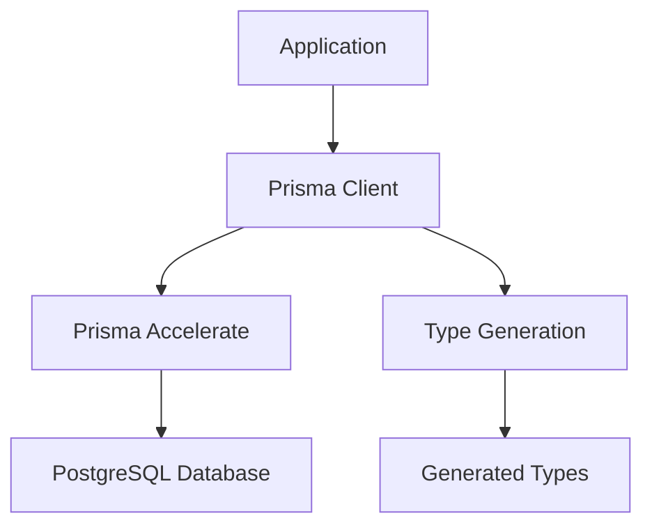

# Architecture Documentation

## Overview

Personal Finance Management App is built with a modern, scalable architecture focusing on type safety, performance, and maintainability. The application follows a full-stack approach with clear separation of concerns.

## Tech Stack Deep Dive

### Frontend Architecture

#### Next.js 15 with App Router

- **Server-Side Rendering**: Optimized for SEO and performance
- **Client Components**: Interactive UI elements
- **File-based Routing**: Intuitive route organization
- **Built-in Optimizations**: Image optimization, font loading, bundle splitting

#### React 19 Features

- **Concurrent Rendering**: Improved user experience
- **Automatic Batching**: Optimized state updates
- **Modern Hooks**: Enhanced component lifecycle management

#### TypeScript Integration

- **Strict Mode**: Enhanced type checking
- **Path Aliases**: `@/` prefix for clean imports
- **Type-safe API Calls**: End-to-end type safety

#### Styling Architecture

- **Tailwind CSS 4**: Utility-first CSS framework
- **CSS Variables**: Dynamic theming support
- **Component Variants**: shadcn/ui component system
- **Responsive Design**: Mobile-first approach

### Backend Architecture

#### Database Layer



#### Prisma ORM

- **Type-safe Queries**: Auto-generated TypeScript types
- **Migration System**: Version-controlled schema changes
- **Connection Pooling**: Optimized database connections
- **Query Optimization**: Intelligent query planning

#### Custom Client Generation

```typescript
// Generated client location: /src/generated/prisma
import { PrismaClient } from "../generated/prisma";
import { withAccelerate } from "@prisma/extension-accelerate";
```

## Project Structure

```tree
personal_finance/
├── src/
│   ├── app/                      # Next.js App Router
│   │   ├── layout.tsx            # Root layout with global providers
│   │   ├── page.tsx              # Home page with metadata
│   │   ├── globals.css           # Global styles and CSS variables
│   │   ├── favicon.ico           # Application favicon
│   │   ├── [locale]/             # Locale-aware routing (i18n)
│   │   │   ├── layout.tsx
│   │   │   ├── (public)/         # Public pages (auth, landing, ecc.)
│   │   │   │   ├── layout.tsx
│   │   │   │   ├── page.tsx
│   │   │   │   └── auth/
│   │   │   │       ├── signin/
│   │   │   │       │   └── page.tsx
│   │   │   │       ├── new-user/
│   │   │   │       │   └── page.tsx
│   │   │   │       ├── error/
│   │   │   │       │   └── page.tsx
│   │   │   │       └── ...
│   │   │   ├── dashboard/
│   │   │   │   ├── layout.tsx
│   │   │   │   └── page.tsx
│   │   │   └── ...
│   │   └── api/
│   │       └── auth/
│   │           └── [...nextauth]/
│   │               └── route.ts   # NextAuth.js API route
│   │
│   ├── components/                # React UI components
│   │   ├── auth-form.tsx
│   │   ├── auth-button.tsx
│   │   ├── add-transaction-button.tsx
│   │   ├── current-month-label.tsx
│   │   ├── dashboard/
│   │   └── ui/
│   │       ├── button.tsx
│   │       ├── card.tsx
│   │       └── ...
│   ├── hooks/                     # Custom React hooks
│   │   └── use-mobile.ts
│   ├── i18n/                      # Internationalization utilities
│   │   ├── navigation.ts
│   │   ├── request.ts
│   │   ├── routing.ts
│   ├── lib/                       # Utility libraries and configurations
│   │   ├── prisma.ts
│   │   ├── auth.ts
│   │   ├── auth-utils.ts
│   │   ├── metadata.config.ts
│   │   ├── pages.config.ts
│   │   └── utils.ts
│   ├── types/                     # TypeScript type definitions
│   │   └── next-auth.d.ts
│   └── generated/                 # Auto-generated files (Git ignored)
│       └── prisma/
│           ├── client.js
│           ├── index.js
│           ├── schema.prisma
│           └── ...
│
├── messages/                      # Localized message files (i18n)
│   ├── en.json
│   └── it.json
│
├── prisma/                        # Database configuration
│   ├── schema.prisma
│   ├── seed.ts
│   └── migrations/
│       ├── migration_lock.toml
│       └── 20250820124253_init/
│           └── migration.sql
│
├── docs/                          # Documentation
│   ├── ARCHITECTURE.md
│   ├── SETUP.md
│   ├── API.md
│   ├── DATABASE.md
│   └── CONTRIBUTING.md
│
├── components.json                # shadcn/ui configuration
├── eslint.config.mjs              # ESLint configuration
├── LICENSE                        # MIT License file
├── next.config.ts                 # Next.js configuration
├── package.json                   # Project dependencies
├── postcss.config.mjs             # PostCSS configuration
├── README.md                      # Project overview
└── tsconfig.json                  # TypeScript configuration
```

## Key Design Decisions

### 1. Custom Prisma Client Location

**Decision**: Generate Prisma client in `/src/generated/prisma`
**Rationale**:

- Keeps generated code separate from application code
- Easier to exclude from Git and IDE indexing
- Clear distinction between written and generated code

### 2. Metadata Configuration System

**Decision**: Page metadata (title, description, etc.) is localized and managed through the `messages/{locale}.json` files and next-intl APIs.

**Implementation**:

- Metadata is defined in the message files (`messages/en.json`, `messages/it.json`) under the `metadata` key.
- Each Next.js page imports metadata using next-intl hooks or functions, based on the active locale.

**Benefits**:

- Native multilingual SEO
- Centralized and scalable metadata management
- No risk of mismatch between content and metadata

### 3. Font Strategy

**Decision**: Roboto font with CSS variables
**Implementation**:

```typescript
const roboto = Roboto({
  variable: "--font-roboto",
  subsets: ["latin"],
});
```

**Benefits**:

- Optimized font loading
- CSS variable flexibility
- Consistent typography system

### 4. shadcn/ui Configuration

**Decision**: New York style with Zinc base color
**Configuration**:

```json
{
  "style": "new-york",
  "rsc": true,
  "tailwind": {
    "baseColor": "zinc",
    "cssVariables": true
  }
}
```

**Benefits**:

- Professional, clean design system
- React Server Component support
- CSS variables for theming

## Data Flow

### Request Lifecycle

1. **Client Request**: User interaction or page load
2. **Next.js Router**: Route resolution and component loading
3. **Server Components**: Initial data fetching
4. **Prisma Client**: Database queries with type safety
5. **Response Generation**: HTML/JSON response with optimizations
6. **Client Hydration**: Interactive components activation

### Database Operations

1. **Schema Definition**: Prisma schema in `prisma/schema.prisma`
2. **Migration Generation**: `prisma migrate dev` creates SQL migrations
3. **Client Generation**: `prisma generate` creates TypeScript client
4. **Query Execution**: Type-safe database operations
5. **Connection Management**: Prisma handles pooling and optimization

## Performance Considerations

### Frontend Optimizations

- **Turbopack**: Fast development builds
- **Code Splitting**: Automatic route-based splitting
- **Image Optimization**: Next.js built-in optimization
- **Font Optimization**: Automatic font subset loading

### Backend Optimizations

- **Prisma Accelerate**: Global database cache and connection pooling
- **Query Optimization**: Intelligent query planning and execution
- **Connection Pooling**: Efficient database connection management

## Security Architecture

### Current Security Measures

- **Type Safety**: Prevents runtime errors and injection attacks
- **Environment Variables**: Secure configuration management
- **HTTPS Enforcement**: Secure data transmission
- **CORS Configuration**: Controlled cross-origin requests

### Planned Security Enhancements

- **Authentication**: NextAuth.js with multiple providers
- **Authorization**: Role-based access control
- **Data Encryption**: Sensitive financial data protection
- **Input Validation**: Server-side validation with Zod
- **Rate Limiting**: API abuse prevention
- **Audit Logging**: Activity tracking and monitoring

## Scalability Considerations

### Current Architecture Benefits

- **Serverless Ready**: Next.js Edge Runtime compatibility
- **Database Scaling**: Prisma Accelerate for global distribution
- **Static Generation**: Pre-rendered pages for performance
- **Incremental Static Regeneration**: Dynamic content with static benefits

### Future Scaling Plans

- **Microservices**: Service separation for complex features
- **Caching Layer**: Redis for session and data caching
- **CDN Integration**: Global content distribution
- **Load Balancing**: Horizontal scaling capabilities
- **Database Sharding**: Data partitioning for large datasets

## Internationalization & Localization

### Multilingua con next-intl

- **Libreria**: [next-intl](https://next-intl-docs.vercel.app/)
- **Locali supportate**: `en` (inglese), `it` (italiano)
- **Gestione messaggi**: file JSON in `/messages/en.json` e `/messages/it.json`
- **Routing locale-aware**: struttura delle route Next.js con segmento `[locale]`
- **Provider**: `NextIntlClientProvider` inietta i messaggi e la lingua nel contesto React
- **Navigazione**: wrapper custom per Link, redirect e router (`@/i18n/navigation`)
- **Fallback**: se la locale richiesta non è supportata, viene usata la `defaultLocale` (`en`)

#### Esempio di configurazione

```typescript
// src/i18n/routing.ts
export const routing = defineRouting({
  locales: ["en", "it"],
  defaultLocale: "en",
});

// src/i18n/request.ts
export default getRequestConfig(async ({ requestLocale }) => {
  const requested = await requestLocale;
  const locale = hasLocale(routing.locales, requested)
    ? requested
    : routing.defaultLocale;
  return {
    locale,
    messages: (await import(`../../messages/${locale}.json`)).default,
  };
});
```

#### Flusso di localizzazione

1. L’utente accede a una route con prefisso locale (`/it/dashboard`)
2. Il middleware e i provider validano la locale
3. I messaggi localizzati vengono caricati dinamicamente
4. Tutti i testi UI sono estratti tramite hook `useTranslations()`

---

## Authentication Architecture

### NextAuth.js con provider multipli

- **Libreria**: [next-auth](https://next-auth.js.org/)
- **Provider supportati**: Google OAuth (se configurato), Credentials (email/password)
- **Adapter**: Prisma Adapter per persistenza utenti e sessioni
- **Sessione**: JWT (stateless), con payload esteso (ruolo, lingua, status, ecc.)
- **Pagine custom**: `/auth/signin`, `/auth/error`, `/auth/new-user`
- **Callback**: personalizzati per arricchire token e sessione, validare lo stato utente, gestire redirect sicuri
- **Eventi**: logging di login/logout e onboarding nuovi utenti

#### Flusso di autenticazione

1. L’utente accede a `/auth/signin` e sceglie Google o email/password
2. Se OAuth, viene reindirizzato a Google e poi validato lato backend
3. Se credentials, la password viene validata con bcrypt e controllato lo stato utente
4. Se login riuscito, viene generato un JWT con dati utente estesi
5. La sessione viene idratata lato client con tutti i dati necessari (ruolo, lingua, ecc.)
6. I redirect sono sempre limitati al dominio dell’app

#### Estratto di configurazione

```typescript
// src/lib/auth.ts
export const authOptions: NextAuthOptions = {
  adapter: PrismaAdapter(prisma),
  providers: [GoogleProvider, CredentialsProvider],
  session: { strategy: "jwt" },
  pages: {
    signIn: "/auth/signin",
    error: "/auth/error",
    newUser: "/auth/new-user",
  },
  callbacks: {
    async signIn({ user, account }) {
      /* ... */
    },
    async jwt({ token, user }) {
      /* ... */
    },
    async session({ session, token }) {
      /* ... */
    },
    async redirect({ url, baseUrl }) {
      /* ... */
    },
  },
  events: {
    async signIn({ user, account, isNewUser }) {
      /* ... */
    },
    async signOut({ session, token }) {
      /* ... */
    },
  },
  debug: process.env.NODE_ENV === "development",
  secret: process.env.NEXTAUTH_SECRET,
};
```

---

## Development Workflow

### Code Organization Principles

1. **Separation of Concerns**: Clear file and folder responsibilities
2. **Type Safety**: TypeScript throughout the stack
3. **Configuration Management**: Centralized settings and environment variables
4. **Documentation**: Self-documenting code with comprehensive docs

### Build Process

1. **Development**: `npm run dev` with Turbopack
2. **Type Checking**: Continuous TypeScript validation
3. **Linting**: ESLint with Next.js configuration
4. **Database**: Prisma migrations and client generation
5. **Production Build**: Optimized static and server assets

This architecture provides a solid foundation for building a comprehensive personal finance management application with room for future growth and feature expansion.
