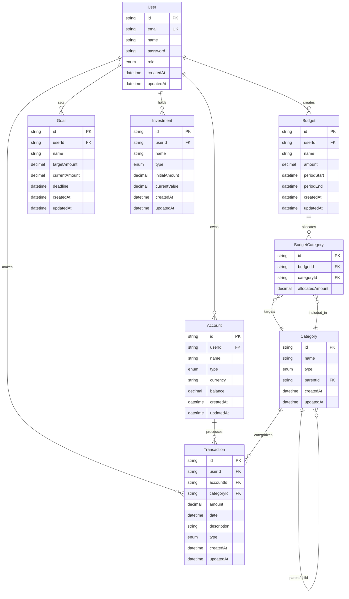

# 🗄️ Entity Relationship Model

## Overview

This document describes the database schema and entity relationships for the Personal Finance Management App. The model is designed to support comprehensive financial tracking, budgeting, and analytics while maintaining data integrity and performance.

## Current Schema

### User Entity

The core entity representing application users.

```typescript
model User {
  id          String    @id @default(cuid())
  email       String    @unique
  name        String
  password    String
  role        UserRole? // Optional for multi-account/family
  createdAt   DateTime  @default(now())
  updatedAt   DateTime  @updatedAt

  // Relations
  accounts     Account[]
  transactions Transaction[]
  budgets      Budget[]
  goals        Goal[]
  investments  Investment[]
}

enum UserRole {
  ADMIN
  MEMBER
  VIEWER
}
```

**Relationships:**

- 1 User → N Account
- 1 User → N Transaction
- 1 User → N Budget
- 1 User → N Goal
- 1 User → N Investment

## Planned Schema Evolution

### Phase 1: Core Financial Entities

#### Account Entity

Represents a personal account or wallet (bank account, card, virtual wallet).

```typescript
model Account {
  id          String      @id @default(cuid())
  userId      String
  name        String      // e.g., "Current Account"
  type        AccountType
  currency    String      @default("EUR")
  balance     Decimal     @db.Decimal(10, 2) @default(0)
  createdAt   DateTime    @default(now())
  updatedAt   DateTime    @updatedAt

  // Relations
  user         User          @relation(fields: [userId], references: [id], onDelete: Cascade)
  transactions Transaction[]
}

enum AccountType {
  BANK
  CASH
  CREDIT_CARD
  CRYPTO
  INVESTMENT
  OTHER
}
```

#### Category Entity

Categorizes income and expenses with optional nesting.

```typescript
model Category {
  id          String    @id @default(cuid())
  name        String    // e.g., "Food", "Salary", "Rent"
  type        CategoryType
  parentId    String?   // Optional for nested categories
  createdAt   DateTime  @default(now())
  updatedAt   DateTime  @updatedAt

  // Relations
  parent       Category?     @relation("CategoryHierarchy", fields: [parentId], references: [id])
  children     Category[]    @relation("CategoryHierarchy")
  transactions Transaction[]
  budgetCategories BudgetCategory[]
}

enum CategoryType {
  INCOME
  EXPENSE
}
```

#### Transaction Entity

Represents a single income or expense entry.

```typescript
model Transaction {
  id          String          @id @default(cuid())
  userId      String
  accountId   String
  categoryId  String
  amount      Decimal         @db.Decimal(10, 2)
  date        DateTime
  description String?
  type        TransactionType
  createdAt   DateTime        @default(now())
  updatedAt   DateTime        @updatedAt

  // Relations
  user        User            @relation(fields: [userId], references: [id], onDelete: Cascade)
  account     Account         @relation(fields: [accountId], references: [id], onDelete: Cascade)
  category    Category        @relation(fields: [categoryId], references: [id])
}

enum TransactionType {
  INCOME
  EXPENSE
}
```

### Phase 2: Budgeting and Goals

#### Budget Entity

Monthly or annual budget with category associations.

```typescript
model Budget {
  id          String    @id @default(cuid())
  userId      String
  name        String    // e.g., "Food Budget August 2025"
  amount      Decimal   @db.Decimal(10, 2)
  periodStart DateTime
  periodEnd   DateTime
  createdAt   DateTime  @default(now())
  updatedAt   DateTime  @updatedAt

  // Relations
  user             User             @relation(fields: [userId], references: [id], onDelete: Cascade)
  budgetCategories BudgetCategory[]
}
```

#### BudgetCategory Entity (Join Table)

Associates a budget with multiple categories.

```typescript
model BudgetCategory {
  id              String   @id @default(cuid())
  budgetId        String
  categoryId      String
  allocatedAmount Decimal  @db.Decimal(10, 2)

  // Relations
  budget   Budget   @relation(fields: [budgetId], references: [id], onDelete: Cascade)
  category Category @relation(fields: [categoryId], references: [id], onDelete: Cascade)

  @@unique([budgetId, categoryId])
}
```

#### Goal Entity

Savings objectives with target amounts and deadlines.

```typescript
model Goal {
  id            String   @id @default(cuid())
  userId        String
  name          String
  targetAmount  Decimal  @db.Decimal(10, 2)
  currentAmount Decimal  @db.Decimal(10, 2) @default(0)
  deadline      DateTime
  createdAt     DateTime @default(now())
  updatedAt     DateTime @updatedAt

  // Relations
  user User @relation(fields: [userId], references: [id], onDelete: Cascade)
}
```

### Phase 3: Advanced Features

#### Investment Entity

Represents investments (stocks, crypto, funds, etc.).

```typescript
model Investment {
  id            String         @id @default(cuid())
  userId        String
  name          String         // e.g., "Apple Stock"
  type          InvestmentType
  initialAmount Decimal        @db.Decimal(10, 2)
  currentValue  Decimal?       @db.Decimal(10, 2)
  createdAt     DateTime       @default(now())
  updatedAt     DateTime       @updatedAt

  // Relations
  user User @relation(fields: [userId], references: [id], onDelete: Cascade)
}

enum InvestmentType {
  STOCK
  CRYPTO
  FUND
  BOND
  ETF
  OTHER
}
```

## Entity Relationship Diagram



## Data Integrity Rules

### Constraints and Validations

1. **User Entity**

   - Email must be unique across the system
   - Password must be hashed before storage

2. **Transaction Entity**

   - Amount must be positive for both income and expenses
   - Date cannot be in the future (configurable)
   - Must belong to an existing user and category

3. **Category Entity**

   - System categories (userId = null) cannot be deleted
   - User cannot delete categories with existing transactions
   - Subcategory type must match or be compatible with parent

4. **Budget Entity**

   - End date must be after start date
   - Amount must be positive
   - Only one active budget per category per overlapping period

5. **Account Entity**
   - Account numbers are encrypted at rest
   - Balance is calculated field based on transactions

### Indexes and Performance

```sql
-- High-performance indexes for common queries
CREATE INDEX idx_transactions_user_date ON transactions(user_id, date DESC);
CREATE INDEX idx_transactions_category ON transactions(category_id);
CREATE INDEX idx_transactions_type_date ON transactions(type, date);
CREATE INDEX idx_categories_user_type ON categories(user_id, type);
CREATE INDEX idx_budgets_user_period ON budgets(user_id, start_date, end_date);
```

## Migration Strategy

### Phase 1: Foundation (Current)

- [x] User model implementation
- [ ] Transaction model
- [ ] Category model
- [ ] Basic relationships

### Phase 2: Core Features

- [ ] Budget model
- [ ] Financial goals
- [ ] Enhanced user preferences

### Phase 3: Investment & Multi-currency

- [ ] Account management
- [ ] Investment tracking
- [ ] Multi-currency support
- [ ] Recurring transactions

### Phase 4: Enterprise Features

- [ ] Family/shared accounts
- [ ] Advanced analytics
- [ ] External integrations
- [ ] Audit logging

## Notes

- All monetary values use `Decimal` type with precision (10,2) for accuracy
- CUID is used for all primary keys for better performance and security
- Soft deletes may be implemented for critical entities
- All user-related data includes cascade delete for GDPR compliance
- Timestamps are automatically managed by Prisma

---

_This document should be updated whenever the database schema changes._
