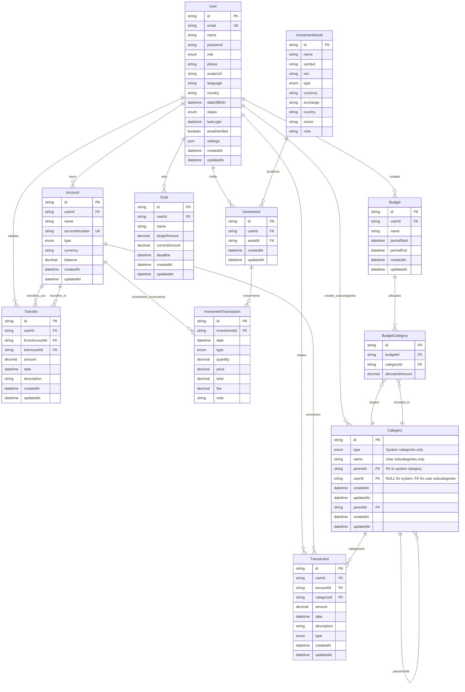

# Entity Relationship Model

## Overview

This document describes the database schema and entity relationships for the Personal Finance Management App. The model is designed to support comprehensive financial tracking, budgeting, and analytics while maintaining data integrity and performance.

## Current Schema

### User Entity

The core entity representing application users.

```typescript
model User {
  id             String    @id @default(cuid())
  email          String    @unique
  name           String
  password       String
  role           UserRole? // ADMIN, MEMBER, VIEWER
  phone          String?   // For 2FA or notifications
  avatarUrl      String?   // Profile image URL
  language       String?   // e.g., "it", "en"
  country        String?   // e.g., "IT", "US"
  dateOfBirth    DateTime?
  status         UserStatus @default(ACTIVE)
  lastLogin      DateTime?
  emailVerified  Boolean   @default(false)
  settings       Json?     // User preferences (theme, notifications, etc.)
  createdAt      DateTime  @default(now())
  updatedAt      DateTime  @updatedAt

  // Relations
  accounts     Account[]
  transactions Transaction[]
  transfers    Transfer[]
  budgets      Budget[]
  goals        Goal[]
  investments  Investment[]
}

enum UserRole {
  ADMIN
  MEMBER
  VIEWER
}

enum UserStatus {
  ACTIVE
  SUSPENDED
  DELETED
}
```

**Relationships:**

- 1 User → N Account
- 1 User → N Transaction
- 1 User → N Transfer
- 1 User → N Budget
- 1 User → N Goal
- 1 User → N Investment

## Planned Schema Evolution

### Phase 1: Core Financial Entities

#### Account Entity

Represents a personal account or wallet (bank account, card, virtual wallet).

```typescript
model Account {
  id            String      @id @default(cuid())
  userId        String
  name          String      // e.g., "Current Account"
  accountNumber String?     // Account identifier (IBAN, card number, etc.)
  type          AccountType
  currency      String      @default("EUR")
  balance       Decimal     @db.Decimal(10, 2) @default(0)
  createdAt     DateTime    @default(now())
  updatedAt     DateTime    @updatedAt

  // Relations
  user         User          @relation(fields: [userId], references: [id], onDelete: Cascade)
  transactions Transaction[]
  investmentTransactions InvestmentTransaction[]
  transfersOut Transfer[]    @relation("TransfersOut")
  transfersIn  Transfer[]    @relation("TransfersIn")

  @@index([accountNumber])
}

enum AccountType {
  BANK
  CASH
  CREDIT_CARD
  CRYPTO
  INVESTMENT
  OTHER
}
```

#### Category Entity

Hybrid categorization system: system-defined root categories with user-defined subcategories.

```typescript
model Category {
  id          String       @id @default(cuid())
  type        CategoryType  // System categories: FOOD, HOUSING, etc. | User subcategories: inherit from parent
  name        String?       // System categories: NULL (use enum) | User subcategories: custom name
  parentId    String?       // System categories: NULL (root level) | User subcategories: FK to system category
  userId      String?       // System categories: NULL (global) | User subcategories: FK to owner
  createdAt   DateTime     @default(now())
  updatedAt   DateTime     @updatedAt

  // Relations
  parent       Category?     @relation("CategoryHierarchy", fields: [parentId], references: [id])
  children     Category[]    @relation("CategoryHierarchy")
  user         User?         @relation(fields: [userId], references: [id], onDelete: Cascade)
  transactions Transaction[]
  budgetCategories BudgetCategory[]

  // Constraints to ensure data integrity
  @@unique([type, userId], name: "unique_system_category_per_user")
}

enum CategoryType {
  // Income categories
  SALARY
  FREELANCE
  INVESTMENT_RETURN
  GIFT_RECEIVED
  OTHER_INCOME

  // Expense categories
  FOOD
  HOUSING
  TRANSPORTATION
  UTILITIES
  ENTERTAINMENT
  HEALTHCARE
  SHOPPING
  EDUCATION
  OTHER_EXPENSE
}
```

**Category Business Rules:**

1. **System Categories (Root Level)**:

   - `type`: CategoryType enum value (FOOD, HOUSING, etc.)
   - `name`: NULL (display name comes from enum)
   - `parentId`: NULL (root level)
   - `userId`: NULL (global, available to all users)

2. **User Subcategories**:

   - `type`: NULL (no enum constraint)
   - `name`: Custom string (e.g., "Restaurants", "Groceries")
   - `parentId`: FK to system category (must be a root category)
   - `userId`: FK to category owner (private to user)

3. **Hierarchy Constraints**:
   - Maximum 2 levels: System → User subcategories
   - Users cannot create root categories
   - Users cannot create subcategories of subcategories
   - System categories are immutable and global

**Examples:**

```text
FOOD (system)                    // type=FOOD, name=NULL, parentId=NULL, userId=NULL
├── "Restaurants" (user)         // type=FOOD, name="Restaurants", parentId=FOOD_ID, userId=123
├── "Groceries" (user)          // type=FOOD, name="Groceries", parentId=FOOD_ID, userId=123
└── "Takeaway" (user)           // type=FOOD, name="Takeaway", parentId=FOOD_ID, userId=123

HOUSING (system)                 // type=HOUSING, name=NULL, parentId=NULL, userId=NULL
├── "Rent" (user)               // type=HOUSING, name="Rent", parentId=HOUSING_ID, userId=123
└── "Utilities" (user)          // type=HOUSING, name="Utilities", parentId=HOUSING_ID, userId=123
```

#### Transaction Entity

Represents a single income or expense entry.

```typescript
model Transaction {
  id          String          @id @default(cuid())
  userId      String
  accountId   String
  categoryId  String
  amount      Decimal         @db.Decimal(10, 2)
  date        DateTime
  description String?
  type        TransactionType
  createdAt   DateTime        @default(now())
  updatedAt   DateTime        @updatedAt

  // Relations
  user        User            @relation(fields: [userId], references: [id], onDelete: Cascade)
  account     Account         @relation(fields: [accountId], references: [id], onDelete: Cascade)
  category    Category        @relation(fields: [categoryId], references: [id])
}

enum TransactionType {
  INCOME
  EXPENSE
}
```

#### Transfer Entity

Represents money transfers between user accounts.

```typescript
model Transfer {
  id              String    @id @default(cuid())
  userId          String
  fromAccountId   String
  toAccountId     String
  amount          Decimal   @db.Decimal(10, 2)
  date            DateTime
  description     String?
  createdAt       DateTime  @default(now())
  updatedAt       DateTime  @updatedAt

  // Relations
  user            User      @relation(fields: [userId], references: [id], onDelete: Cascade)
  fromAccount     Account   @relation("TransfersOut", fields: [fromAccountId], references: [id], onDelete: Cascade)
  toAccount       Account   @relation("TransfersIn", fields: [toAccountId], references: [id], onDelete: Cascade)

  // Constraints
  @@check(fromAccountId != toAccountId, name: "no_self_transfer")
}
```

### Phase 2: Budgeting and Goals

#### Budget Entity

Monthly or annual budget with category associations. Total amount is calculated dynamically from BudgetCategory allocations.

```typescript
model Budget {
  id          String    @id @default(cuid())
  userId      String
  name        String    // e.g., "Monthly Budget January 2025"
  periodStart DateTime
  periodEnd   DateTime
  createdAt   DateTime  @default(now())
  updatedAt   DateTime  @updatedAt

  // Relations
  user             User             @relation(fields: [userId], references: [id], onDelete: Cascade)
  budgetCategories BudgetCategory[]
}
```

#### BudgetCategory Entity (Join Table)

Associates a budget with multiple categories.

```typescript
model BudgetCategory {
  id              String   @id @default(cuid())
  budgetId        String
  categoryId      String
  allocatedAmount Decimal   @db.Decimal(10, 2)
  createdAt       DateTime  @default(now())
  updatedAt       DateTime  @updatedAt

  // Relations
  budget   Budget   @relation(fields: [budgetId], references: [id], onDelete: Cascade)
  category Category @relation(fields: [categoryId], references: [id], onDelete: Cascade)

  @@unique([budgetId, categoryId])
}
```

#### Goal Entity

Savings objectives with target amounts and deadlines.

```typescript
model Goal {
  id            String   @id @default(cuid())
  userId        String
  name          String
  targetAmount  Decimal  @db.Decimal(10, 2)
  currentAmount Decimal  @db.Decimal(10, 2) @default(0)
  deadline      DateTime
  createdAt     DateTime @default(now())
  updatedAt     DateTime @updatedAt

  // Relations
  user User @relation(fields: [userId], references: [id], onDelete: Cascade)
}
```

### Phase 3: Advanced Features

#### Investment Model (Advanced)

```typescript
model InvestmentAsset {
  id        String   @id @default(cuid())
  name      String   // e.g., "Apple Inc.", "Bitcoin", "MSCI World ETF"
  symbol    String?  // e.g., "AAPL", "BTC", "SWDA"
  isin      String?  // International Securities Identification Number
  type      AssetType // STOCK, CRYPTO, ETF, FUND, BOND, etc.
  currency  String   // e.g., "USD", "EUR"
  exchange  String?  // e.g., "NASDAQ", "XETRA"
  country   String?  // e.g., "US", "DE"
  sector    String?  // e.g., "Technology", "Finance"
  note      String?
  createdAt DateTime @default(now())
  updatedAt DateTime @updatedAt

  investments Investment[]
}

enum AssetType {
  STOCK
  CRYPTO
  ETF
  FUND
  BOND
  DERIVATIVE
  COMMODITY
  OTHER
}

model Investment {
  id            String   @id @default(cuid())
  userId        String
  assetId       String
  createdAt     DateTime @default(now())
  updatedAt     DateTime @updatedAt

  // Relations
  user          User     @relation(fields: [userId], references: [id], onDelete: Cascade)
  asset         InvestmentAsset @relation(fields: [assetId], references: [id])
  transactions  InvestmentTransaction[]
}

model InvestmentTransaction {
  id            String   @id @default(cuid())
  investmentId  String
  accountId     String   // Involved account (bank, broker, etc.) - mandatory!
  date          DateTime
  type          InvestmentTransactionType // BUY, SELL, DIVIDEND, FEE, etc.
  quantity      Decimal
  price         Decimal   // Unit price
  total         Decimal   // Total operation (quantity * price + fee)
  fee           Decimal?  // Fees
  note          String?
  createdAt     DateTime @default(now())
  updatedAt     DateTime @updatedAt

  // Relations
  investment    Investment @relation(fields: [investmentId], references: [id], onDelete: Cascade)
  account       Account    @relation(fields: [accountId], references: [id])
}

enum InvestmentTransactionType {
  BUY
  SELL
  DIVIDEND
  FEE
  INTEREST
  OTHER
}
```

## Entity Relationship Diagram



## Data Integrity Rules

### Constraints and Validations

1. **User Entity**

   - Email must be unique across the system
   - Password must be hashed before storage

2. **Transaction Entity**

   - Amount must be positive for both income and expenses
   - Date cannot be in the future (configurable)
   - Must belong to an existing user and category

3. **Category Entity**

   - System categories (userId = null) cannot be deleted
   - User cannot delete categories with existing transactions
   - Subcategory type must match or be compatible with parent

4. **Budget Entity**

   - End date must be after start date
   - Amount must be positive
   - Only one active budget per category per overlapping period

5. **Account Entity**
   - Account numbers are encrypted at rest
   - Balance is calculated field based on transactions

### Indexes and Performance

```sql
-- High-performance indexes for common queries
CREATE INDEX idx_transactions_user_date ON transactions(user_id, date DESC);
CREATE INDEX idx_transactions_category ON transactions(category_id);
CREATE INDEX idx_transactions_type_date ON transactions(type, date);
CREATE INDEX idx_categories_user_type ON categories(user_id, type);
CREATE INDEX idx_budgets_user_period ON budgets(user_id, start_date, end_date);
```

## Migration Strategy

### Phase 1: Foundation (Current)

- [x] User model implementation
- [ ] Transaction model
- [ ] Category model
- [ ] Basic relationships

### Phase 2: Core Features

- [ ] Budget model
- [ ] Financial goals
- [ ] Enhanced user preferences

### Phase 3: Investment & Multi-currency

- [ ] Account management
- [ ] Investment tracking
- [ ] Multi-currency support
- [ ] Recurring transactions

### Phase 4: Enterprise Features

- [ ] Family/shared accounts
- [ ] Advanced analytics
- [ ] External integrations
- [ ] Audit logging

## Notes

- All monetary values use `Decimal` type with precision (10,2) for accuracy
- CUID is used for all primary keys for better performance and security
- Soft deletes may be implemented for critical entities
- All user-related data includes cascade delete for GDPR compliance
- Timestamps are automatically managed by Prisma

---

_This document should be updated whenever the database schema changes._
